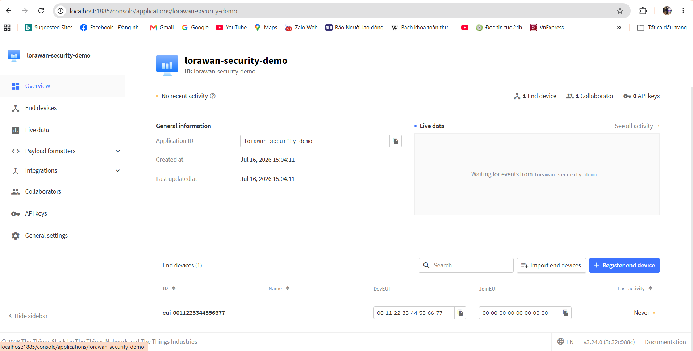
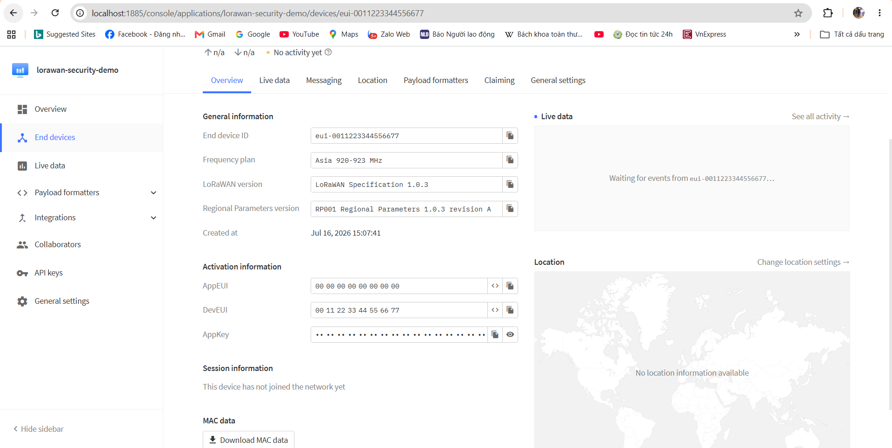

# n18-secure-LoRaWAN-IOT
# Bảo mật LoRaWAN trong Hệ thống IoT
 
## 1. Mô tả đề tài
 
Đề tài nghiên cứu và thực nghiệm về bảo mật trong mạng **LoRaWAN (Long Range Wide Area Network)** — giao thức truyền thông không dây tầm xa, năng lượng thấp, được sử dụng phổ biến trong các hệ thống IoT như đo đạc từ xa, nông nghiệp thông minh, giám sát môi trường và thành phố thông minh.
 
Nội dung thực hiện:
 
- Phân tích kiến trúc mạng LoRaWAN gồm End Device, Gateway, Network Server và Application Server.
- Phân tích cơ chế bảo mật của LoRaWAN: mã hóa AES-128, khóa `AppKey`/`NwkKey`, quy trình kích hoạt thiết bị OTAA (Over-The-Air Activation) so với ABP (Activation By Personalization), và cơ chế toàn vẹn dữ liệu bằng MIC (Message Integrity Code).
- Triển khai hệ thống thử nghiệm sử dụng **The Things Stack** làm Network Server/Application Server, kết hợp thiết bị đầu cuối chạy firmware dựa trên thư viện **MCCI Arduino LoRaWAN**.
- Đối chiếu và đánh giá hệ thống thử nghiệm theo tiêu chuẩn **OWASP IoT Security Verification Standard (ISVS)**, tập trung vào các mục liên quan đến quản lý khóa, xác thực thiết bị và mã hóa truyền tải.
- Ghi nhận kết quả thực nghiệm, ảnh minh chứng và giới hạn an toàn của quá trình thử nghiệm.
## 2. Nguồn đã sử dụng
 
- **The Things Stack**: đóng vai trò Network Server, xử lý join-request theo cơ chế OTAA, giải mã và định tuyến dữ liệu từ thiết bị.
- **MCCI Arduino LoRaWAN**: thư viện firmware chạy trên thiết bị đầu cuối, thực hiện mã hóa AES-128 và quy trình OTAA khi gửi dữ liệu lên Network Server.
- **OWASP ISVS**: bộ tiêu chuẩn dùng làm khung tham chiếu để rà soát và đánh giá mức độ bảo mật của hệ thống thử nghiệm.
## 3. Cách chạy
 
### 3.1. Phần cứng yêu cầu
 
- Board vi điều khiển hỗ trợ LoRa (ví dụ Arduino MKR WAN 1300/1310 hoặc module LoRa kết hợp MCU tương thích).
- Gateway LoRaWAN, hoặc sử dụng gateway ảo/kết nối tới The Things Stack Sandbox.
- Máy tính có kết nối Internet để truy cập console quản trị của The Things Stack.
### 3.2. Cài đặt Network Server (The Things Stack) — tự triển khai bằng Docker trên localhost
 
```bash
git clone --branch v3.34 https://github.com/TheThingsNetwork/lorawan-stack.git
cd lorawan-stack
```
 
Do triển khai trên localhost (không có domain/certificate thật), cấu hình `docker-compose.yml` tắt TLS ở toàn bộ các tầng (HTTP, gRPC, Interop), đồng thời khai báo `HTTP_COOKIE_BLOCK_KEY`/`HASH_KEY` và OAuth client cho Console. Sau khi chạy 3 service (`redis`, `postgres`, `stack`), khởi tạo dữ liệu ban đầu theo thứ tự:
 
```bash
docker compose run --rm stack is-db migrate
docker compose run --rm stack is-db create-admin-user --id admin --email <email>
docker compose run --rm stack is-db create-oauth-client --id cli --name "CLI" --owner admin --no-secret --redirect-uri "local-callback" --redirect-uri "code"
docker compose run --rm stack is-db create-oauth-client --id console --name "Console" --owner admin --secret "console" --redirect-uri "http://localhost:1885/console/oauth/callback" --redirect-uri "/console/oauth/callback" --logout-redirect-uri "http://localhost:1885/console" --logout-redirect-uri "/console"
docker compose up
```
 
Truy cập Console quản trị tại `http://localhost:1885/console`.
 
### 3.3. Cấu hình thiết bị đầu cuối (Firmware)
 
```bash
git clone --branch master https://github.com/mcci-catena/arduino-lorawan.git
```
 
1. Cài thư viện vào Arduino IDE thông qua `Sketch > Include Library > Add .ZIP Library`.
2. Cấu hình `AppEUI`, `DevEUI`, `AppKey` lấy từ trang quản trị The Things Stack.
3. Nạp sketch mẫu OTAA trong thư mục `examples/` vào board.
4. Mở Serial Monitor để theo dõi quá trình Join (OTAA) và gửi dữ liệu.
### 3.4. Đánh giá theo OWASP ISVS
 
Rà soát hệ thống thử nghiệm theo checklist mục V3 (Communication Security) và V4 (Software Platform Security) của OWASP ISVS, tập trung vào quản lý khóa, xác thực thiết bị và mã hóa truyền tải.
 
## 4. Kết quả
 
### 4.1. Đã đạt được
 
- Triển khai thành công **The Things Stack (Network Server)** bằng Docker trên localhost; đăng nhập được vào Console quản trị bằng tài khoản admin.
- Tạo thành công **Application** (`lorawan-security-demo`) trên Network Server.
- Đăng ký thành công **1 End Device** ở chế độ **OTAA**, cấu hình:
  - Frequency plan: Asia 920-923 MHz (AS923)
  - LoRaWAN version: 1.0.3 (RP001 Regional Parameters 1.0.3 revision A)
  - Đã sinh đầy đủ bộ khóa bảo mật: `AppEUI (JoinEUI)`, `DevEUI`, `AppKey` (AES-128) — dùng cho quy trình xác thực OTAA giữa thiết bị và Network Server.
- Xác minh cơ chế quản lý danh tính/khóa của LoRaWAN qua giao diện thực tế: mỗi thiết bị được cấp một `AppKey` duy nhất do Network Server quản lý, thiết bị chỉ join được nếu chứng minh sở hữu đúng khóa này trong quá trình bắt tay OTAA.
### 4.2. Đang thực hiện (kế hoạch Tuần 03)
 
- Thiết bị **chưa Join vào mạng** ("This device has not joined the network yet") vì chưa có board LoRa vật lý thật để nạp firmware và bật thiết bị.
- Chưa thực hiện được: quan sát log Join OTAA thực tế, bắt gói tin xác minh mã hóa AES-128, kiểm thử frame counter chống replay.
- Việc rà soát theo checklist OWASP ISVS (mục V3, V4) sẽ thực hiện dựa trên cấu hình hệ thống đã triển khai.
### 4.3. Khó khăn kỹ thuật đã xử lý trong quá trình triển khai
 
- **Lỗi cổng TLS**: bản Docker mặc định cố mở các listener TLS (gRPC, HTTP, Interop) dù không có certificate, gây crash liên tục. Khắc phục bằng cách set rỗng các biến `TTN_LW_GRPC_LISTEN_TLS`, `TTN_LW_HTTP_LISTEN_TLS`, `TTN_LW_INTEROP_LISTEN_TLS`.
- **Lệnh `is-db init` đã lỗi thời**: ở bản 3.24.0 cần dùng `is-db migrate` thay thế, nếu không database sẽ trống dù không báo lỗi rõ ràng.
- **Container xung đột cùng network**: phát hiện một container Postgres còn sót lại từ một lần thử nghiệm trước đó (thuộc project Docker khác) vẫn gắn chung network `ttn-network`, khiến tên miền nội bộ `postgres` bị phân giải nhầm lẫn giữa 2 container khác nhau — gây lỗi `relation does not exist` không ổn định, rất khó chẩn đoán. Khắc phục bằng cách rà soát toàn bộ container bằng `docker ps -a` và loại bỏ container không thuộc project hiện tại.
- **Timeout khi tạo tài khoản qua CLI**: lệnh `is-db create-admin-user` đôi khi báo `context deadline exceeded` khi nhập password thủ công quá chậm; khắc phục bằng cách chuẩn bị sẵn password và dán nhanh.
## 5. Ảnh minh chứng
 

 

 

 
*(Ảnh minh chứng bổ sung cho Tuần 03: log Join OTAA từ thiết bị thật, gói tin đã mã hóa, kết quả checklist OWASP ISVS — sẽ cập nhật sau khi có phần cứng.)*
 
## 6. Giới hạn an toàn
 
- Thử nghiệm được thực hiện trong môi trường lab cô lập, không tấn công lên hạ tầng LoRaWAN của bên thứ ba hoặc hệ thống sản xuất thực tế.
- Không thực hiện jamming, brute-force khóa hoặc các hình thức tấn công gây gián đoạn dịch vụ trên thiết bị không thuộc quyền sở hữu của nhóm.
- Không công bố `AppKey`, `DevEUI` hoặc bất kỳ thông tin định danh thiết bị thật nào của bên thứ ba.
- Kết quả đánh giá theo OWASP ISVS chỉ mang tính chất tham khảo học thuật, không thay thế cho một audit bảo mật chính thức.
- Mọi khóa mẫu sử dụng trong tài liệu này đều là khóa giả lập cho mục đích thử nghiệm.
## 7. Tài liệu tham khảo kỹ thuật
 
| Tài liệu | Nguồn | Nhánh/Thẻ | Ngày truy cập | Phần sử dụng |
|---|---|---|---|---|
| [The Things Stack](https://github.com/TheThingsNetwork/lorawan-stack) | TheThingsNetwork | `v3.34` | 09/07/2026 | Mã nguồn Network Server/Application Server dùng để triển khai môi trường thử nghiệm: cấu hình Docker Compose, xử lý join-request OTAA, quản lý khóa AppKey/NwkKey |
| [MCCI Arduino LoRaWAN](https://github.com/mcci-catena/arduino-lorawan) | MCCI Corporation | `master` | 09/07/2026 | Thư viện firmware cho thiết bị đầu cuối; sketch mẫu trong `examples/` triển khai quy trình OTAA và mã hóa AES-128 khi gửi dữ liệu cảm biến |
| [OWASP ISVS](https://github.com/OWASP/IoT-Security-Verification-Standard-ISVS) | OWASP | `master` | 09/07/2026 | Checklist mục V3 (Communication Security) và V4 (Software Platform Security) dùng làm khung tham chiếu đánh giá hệ thống thử nghiệm |
 
| [MCCI Arduino LoRaWAN](https://github.com/mcci-catena/arduino-lorawan) | MCCI Corporation | `master` | 09/07/2026 | Thư viện firmware cho thiết bị đầu cuối; sketch mẫu trong `examples/` triển khai quy trình OTAA và mã hóa AES-128 khi gửi dữ liệu cảm biến |
| [OWASP ISVS](https://github.com/OWASP/IoT-Security-Verification-Standard-ISVS) | OWASP | `master` | 09/07/2026 | Checklist mục V3 (Communication Security) và V4 (Software Platform Security) dùng làm khung tham chiếu đánh giá hệ thống thử nghiệm |

